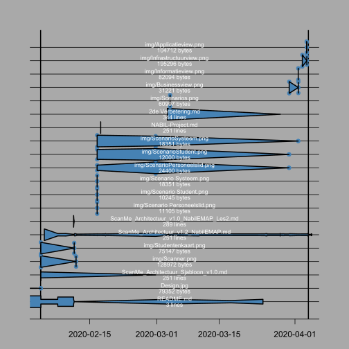
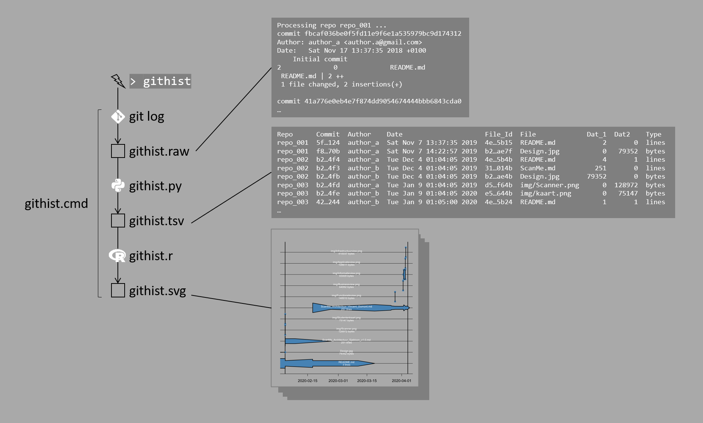

# Visualize the evolution of file sizes in a git repo

Scripts to generate timeline of all (or a subset) of files in several git repositories. The end result for each repository is a time line that looks like this:



The x-axis represents time, the y-axis file size (normalized per file). Each row represents a (renamed) file. The thick lines on the left and the right are the `start_time` and the `end_time` (see [below](#how-to-run-it)).

## Introduction

Suppose you want to follow the evolution of file sizes across several commits as shown in the graph above, and then do this in batch for many git repositories. This is typically what you would encounter when using [GitHub Classroom](https://classroom.github.com/) but there are probably other use cases too.

_Warning: There are many ways to do this and the solution presented here may well be the ugliest, but it may have the advantage of adaptability._

## Prerequisites

Make sure you have recent versions of [git](https://git-scm.com/), [python](https://www.python.org/) and [R](https://www.r-project.org/) installed.

## How to run it

_Note: Scripts are prepared for Microsoft Windows users, but with minor changes you should be able to run this on any platform._

Place the files `githist.cmd`, `githist.r` and `githist.py` in the parent folder containing one or more subfolders that are git repositories.

Configure the plots:

```r
# githist.r

# [...]

# Configuration
exclude_logins <- c("ddhaese", "David D'Haese") # exclude this authors from revision list

# If you change next line, then adjust githist.cmd accordingly
source_file <- "githist.tsv"
target_file <- "githist.svg"
start_time <- as.POSIXct("2020-02-04")
end_time <- as.POSIXct("2020-04-04")

palette(c("darkgrey", "steelblue", "white"))
# [...]
```

In your preferred [CLI](https://en.wikipedia.org/wiki/Command-line_interface) run this command:

```cmd.exe
githist
```

Use `ctrl + C` to stop it.

## Behind the scenes

Behind the scenes, git, python and r are being called to generate timelines (as svg images) and place them in appropriate repositories. Obviously, it is up to you to refactor these files to your needs.


